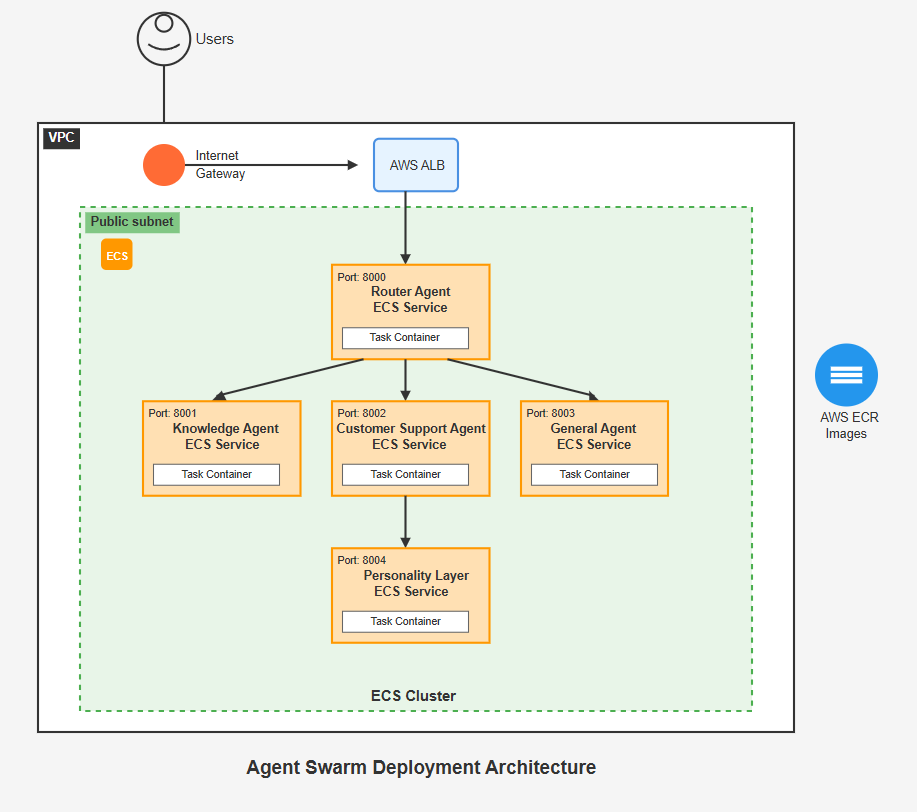

# Agent Swarm

## Table of Contents
1. [Introduction](#introduction)
2. [Agent Swarm Architecture](#agent-swarm-architecture)
3. [Agents](#agents)
   1. [Router Agent](#1-router-agent)
   2. [Knowledge Agent](#2-knowledge-agent)
      - [Knowledge Agent Explanation](#21-knowledge-agent-explanation) 
      - [RAG Pipeline Explanation](#22-rag-pipeline-explanation) 
   3. [Customer Support Agent](#3-customer-support-agent)
   4. [General Agent](#4-general-agent)
   5. [Personality Layer](#5-personality-layer)
4. [How to Run](#how-to-run)
5. [API Endpoints](#api-endpoints)
6. [Testing](#testing)
7. [Dockerization](#dockerization)
8. [Deployment](#deployment)
9. [Framework Choice and Design Decisions](#framework-choice-and-design-decisions)
10. [Conclusion](#conclusion)

---

## Introduction
Welcome to the **Agent Swarm**! This project is a multi-agent system designed to handle various types of queries and generate responses by routing them to specialized agents. The architecture includes agents that handle queries related to **InfinitePay's products**, **customer support**, and **general queries** (e.g., news, etc.). 

The system also integrates **tools** such as the **Slack notification tool** for suspicious activities and **News retrieval tool** to fetch news based on topics or cities.

---

## Agent Swarm Architecture
The architecture of the Agent Swarm consists of the following main agents and components:

- **Router Agent**: Decides which specialized agent will handle a user's query.
- **Knowledge Agent**: Handles queries related to InfinitePay products and services.
- **Customer Support Agent**: Handles queries related to customer support.
- **General Agent**: Handles general-purpose queries and uses tools for specific needs like news and suspicious activities.
- **Personality Layer**: Enhances the response to be more user-friendly and empathetic.

<p align="center">

</p>

---

## Agents

### 1. **Router Agent**
- **Role**: Decides which agent (KnowledgeAgent, CustomerSupportAgent, or GeneralAgent) should handle the incoming query based on its content.
- **Responsibilities**:
  - Routes the query to the appropriate agent.
  - Manages the workflow and data flow between agents.

### 2. **Knowledge Agent**

#### 2.1 Knowledge Agent Explanation

- **Role**: Answers questions based on publicly available content from the InfinitePay website (https://www.infinitepay.io/) or general search results.
- **Features**:
  - Uses a **Retrieval Augmented Generation (RAG)** pipeline to fetch data from the InfinitePay website.
  - If no data is found in the knowledge base, uses the **DuckDuckGo search tool**.

#### 2.2 **RAG Pipeline Explanation**

The **Knowledge Agent** uses a **Retrieval-Augmented Generation (RAG)** pipeline to handle queries efficiently. The pipeline is designed to retrieve relevant data from a pre-built knowledge base and then generate an accurate response using the retrieved information. This method ensures that the responses are grounded in factual data from InfinitePay's website and other external sources.

#### **How the RAG Pipeline Works**:
1. **Scraping Content**: The agent scrapes content from the specified InfinitePay website pages, extracting relevant sections such as headings, paragraphs, and lists.
2. **Text Chunking**: The scraped content is divided into smaller chunks of 500 words. This allows the information to be processed more efficiently and indexed for faster search results.
3. **Vectorization**: The text chunks are converted into vectors using a **HuggingFace** embeddings model (`paraphrase-multilingual-MiniLM-L12-v2`), which is used for similarity search. These vectors are stored in a **FAISS** vector database for quick retrieval.
4. **Similarity Search**: When a user submits a query, the system performs a similarity search on the vector database. It retrieves the top 3 matching documents based on their relevance to the query.
5. **Response Generation**: If relevant documents are found, they are passed to the **GPT-4 model** for response generation. If no relevant data is found in the knowledge base, the agent will use the **DuckDuckGo** search tool to search the web for relevant answers.
6. **Fallback**: If the similarity search fails to find relevant data, the system defaults to using the DuckDuckGo search tool to provide the most relevant information from external sources.

This process ensures that the **Knowledge Agent** provides accurate and contextually relevant responses to user queries, backed by the most up-to-date information from InfinitePay's website and the web.
  
#### Tools:
- **Web search using DuckDuckGo** for external general queries.

### 3. **Customer Support Agent**
- **Role**: Handles customer queries related to account issues, payment problems, and other support requests.
- **Features**:
  - Integrated with an **FAQ system** that checks the similarity of the query to frequently asked questions.
  - Uses internal **Database Tool** to retrieve user data and respond.
  - Uses **Email Tool** to notify the support team if necessary (Redirect mechanism to human).

#### Tools:
- **Database Tool** to access user data.
- **Email Tool** to notify the support team.

### 4. **General Agent**
- **Role**: Handles general-purpose queries, including those unrelated to InfinitePay or customer support.
- **Features**:
  - If the query is suspicious or illegal, the agent uses the **Slack notification tool** to alert the team (Guardrails for handle undesired questions).
  - If the query relates to news, the agent uses the **News Tool** to fetch relevant articles based on the user's city or topic(From newsdata.io API).

#### Tools:
- **Slack Notification Tool** for suspicious queries.
- **News Tool** to fetch articles based on a city or topic.

### 5. **Personality Layer**
- **Role**: Rewrites responses in a more natural, friendly, and empathetic tone to enhance user experience.
  
---

## How to Run

1. **Clone the repository**:
    ```bash
    git clone https://github.com/Ankur1911/Agent-Swarm-Microservice.git
    cd Agent-Swarm-Microservice
    ```

2. **Install dependencies**:
    - Create a virtual environment:
      ```bash
      python3 -m venv myenv
      ```
    - Activate the virtual environment:
      ```bash
      # On Windows
      myenv\Scripts\activate
      # On Linux/macOS
      source myenv/bin/activate
      ```
    - Install the required dependencies:
      ```bash
      pip install -r requirements.txt
      ```
3. **Create .env file**:
   Add variables in it.
   ```
   API_ENDPOINT
   API_KEY
   SLACK_WEBHOOK_URL
   SUPPORT_EMAIL  
   SMTP_SERVER 
   SMTP_PORT 
   SENDER_EMAIL 
   SENDER_PASSWORD
   ```
4. **(Optional) Run Individual Agents**: Make sure to change ports on each main.py file and also in routing urls.
   Open a separate terminal for each of the agents and run them using: 
    ```bash
    cd .\services\{Agent-Name}
    python .\main.py
    ```

5. **Run All Agents Using Docker Compose**: Make sure docker compose is installed.
    ```
    docker-compose up --build
    ```
    You can access the API at:
    ```
    http://localhost:8000/ask
    ```

---

## API Endpoints

### POST `/ask`
- **Description**: Handles user queries by passing them to the appropriate agent for processing.
- **Request body**:
    ```json
    {
    "user_id":"client789",
    "message":"What are the rates for debit and credit card transactions?"
   }
    ```
- **Response**:
    ```json
    {
    "response": "Here are the transaction rates for card and payment link sales:\n\n- Credit card (one-time payment): 5.49%\n- Installments up to 6 times: 13.99%\n- Installments up to 12 times: 18.29%\n\nFor Pix transactions, there is no fee, so you can receive instant payments at 0.00%.",
    "source_agent_response": "As taxas para vendas no cartão e no Link de Pagamento são as seguintes:\n\n- Crédito à vista: 5,49%\n- Parcelado em 6x: 13,99%\n- Parcelado em 12x: 18,29%\n\nPara o serviço Pix, a taxa é zero, permitindo receber na hora por 0,00%.",
    "agent_workflow": [
        {
            "agent_name": "RouterAgent",
            "tool_calls": {
                "LLM": "KnowledgeAgent"
            }
        },
        [
            {
                "agent_name": "KnowledgeAgent",
                "tool_calls": {
                    "RAG": "As taxas para vendas no cartão e no Link de Pagamento são as seguintes:\n\n- Crédito à vista: 5,49%\n- Parcelado em 6x: 13,99%\n- Parcelado em 12x: 18,29%\n\nPara o serviço Pix, a taxa é zero, permitindo receber na hora por 0,00%."
                }
            }
        ],
        {
            "agent_name": "PersonalityLayer",
            "tool_calls": {
                "LLM": "Here are the transaction rates for card and payment link sales:\n\n- Credit card (one-time payment): 5.49%\n- Installments up to 6 times: 13.99%\n- Installments up to 12 times: 18.29%\n\nFor Pix transactions, there is no fee, so you can receive instant payments at 0.00%."
            }
        }
    ]
    }
    ```

---

## Testing

Here are some test cases to check the functionality:

 **[Test Cases Link](test-cases.md)**

1. **Unit Tests**: Ensure the correct functioning of individual agents (KnowledgeAgent, CustomerSupportAgent, GeneralAgent).
2. **Integration Tests**: Test the interaction between agents (e.g., RouterAgent routing to the correct agent).
3. **API Tests**: Use tools like **Postman** or **Insomnia** to test the `/ask` endpoint.

---

## Dockerization

### Dockerfile
A **Dockerfile** is provided to containerize the application. You can build and run the container with the following commands:

1. **Build the Docker image**:
    ```bash
    docker build -t agent-swarm-app .
    ```

2. **Run the Docker container**:
    ```bash
    docker run -p 8000:8000 agent-swarm-app
    ```

3. **Access the application**:
    The app will be available at `http://localhost:8000`.

---

## Deployment

The Agent Swarm is deployed on **AWS** using a containerized architecture with the following components:

### Infrastructure Components:
- **VPC (Virtual Private Cloud)**: Isolated network environment
- **Public Subnet**: Contains the load balancer and internet-facing resources
- **Internet Gateway**: Provides internet access to the VPC
- **AWS ALB (Application Load Balancer)**: Distributes incoming traffic across ECS services
- **ECS Cluster**: Container orchestration platform running the agent services

### Service Deployment:
1. **Router Agent ECS Service** (Port 8000)
   - Main entry point for all user requests
   - Routes queries to appropriate specialized agents

2. **Customer Support Agent ECS Service** (Port 8001)
   - Handles customer support and account-related queries
   - Integrated with FAQ system and database tools

3. **General Agent ECS Service** (Port 8003)
   - Processes general queries and news requests
   - Includes suspicious activity detection

4. **Knowledge Agent ECS Service** (Port 8004)
   - Manages InfinitePay product-related queries
   - Utilizes RAG pipeline for accurate responses

### Deployment Steps:
1. **Build Docker Images**: Each agent is containerized and pushed to AWS ECR (Elastic Container Registry)
2. **ECS Task Definitions**: Define container specifications and resource requirements
3. **ECS Services**: Deploy and manage running instances of each agent
4. **Load Balancer Configuration**: Set up routing rules to distribute traffic
5. **Auto Scaling**: Configure automatic scaling based on demand

### Benefits of This Architecture:
- **Scalability**: Individual agents can be scaled independently
- **High Availability**: Multiple instances ensure system reliability
- **Load Distribution**: ALB efficiently distributes traffic
- **Container Management**: ECS handles deployment and health monitoring
- **Cost Optimization**: Pay only for resources actually used

<p align="center">

</p>
---

## Framework Choice and Design Decisions

### **1. Why I Chose to Use Manual Implementation Alongside LangChain and LangGraph**
In the development of the **Agent Swarm** system, I decided to use a **hybrid approach**, combining **manual implementation** with the integration of **LangChain** and **LangGraph**. Here's the rationale behind this decision:

- **Manual Implementation**: The core of the system was developed manually to understand the fundamentals of **multi-agent systems** and **agent communication**. This manual approach allowed me to customize the system according to specific needs and gain a deeper understanding of how each agent works.

- **LangChain and LangGraph Reference**: To support users who may want to build similar systems using **LangChain** or **LangGraph**, I included a folder called **`langgraph`**. This folder contains a reference implementation that leverages both frameworks to build agent systems. Although these implementations work and can be used as an alternative, they may require further improvements, especially in terms of scalability and error handling.

### **2. Why I Haven't Used LangChain and LangGraph Directly**
Although I am familiar with **LangChain** and **LangGraph**, I chose to build the Agent Swarm manually to better understand the underlying mechanics of agent communication, state management, and routing. This decision allowed me to:
- Gain hands-on experience with the **core principles** behind multi-agent systems.
- Customize the architecture in a way that fits my design preferences.
- Dive deeper into **agent orchestration**, error handling, and **workflow management**.

However, I am well-versed in how **LangChain** and **LangGraph** can streamline the development process, and I understand how they abstract the complexities of agent routing and state management. If I were to scale or refactor this system in the future, I would likely leverage **LangChain** to manage the agent tools and **LangGraph** for the state flow and transitions.

---

## Conclusion

This Agent Swarm is designed to effectively route queries to the appropriate agent based on their content. Each agent is specialized to handle different types of requests, from product-related queries to customer support and general inquiries. The system uses a variety of tools to enrich responses and ensure smooth user interaction.
### You can test it at :
```
http://agent-swarm-frontend1.s3-website-us-east-1.amazonaws.com/
```
### Example Question :
<p align="center">

</p>

### Response :
<div style="display: flex; justify-content: space-between; align-items: flex-start;">
  
  
</div>

---
