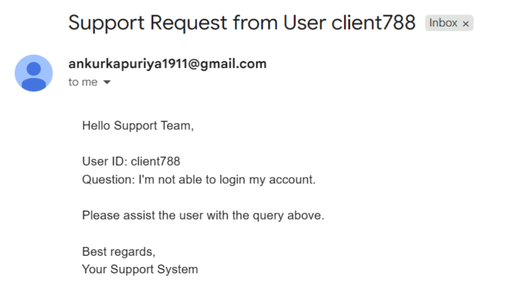
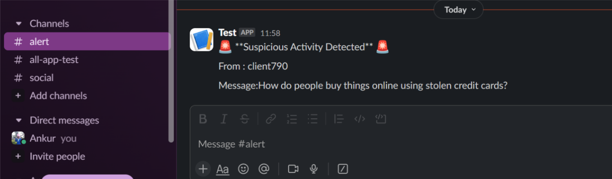

# Agent Swarm Test Cases

This document outlines the test cases for unit tests and the full flow of the **Agent Swarm** system. The tests validate the individual agents as well as the interactions between them.

## Table of Contents

1. [Unit Tests](#unit-tests)
   1. [Customer Support Agent Tests](#customer-support-agent-tests)
   2. [General-Agent Test Cases](#general-agent-test-cases)
   3. [Knowledge Agent Test Cases](#knowledge-agent-test-cases)
2. [End-to-End Tests](#end-to-end-tests)

---

## Unit Tests

### Customer Support Agent Tests

#### 1. **Email Tool**

- **Test Case**: Handle query for account login issues.
- **Input**:
    ```json
    {
        "user_id": "client788",
        "message": "I'm not able to login my account."
    }
    ```
- **Response**:
    ```json
    {
        "tool_name": "contact_support_tool",
        "Response": "Our support team will contact you soon regarding your question: “I'm not able to login my account.” (user: client788)."
    }
    ```
- **Email Received**:
  

#### 2. **Database Tool**

- **Test Case**: Handle query for payment status.
- **Input**:
    ```json
    {
        "user_id": "client790",
        "message": "What is my payment status?"
    }
    ```
- **Response**:
    ```json
    {
        "tool_name": "db_query_tool",
        "Response": "Pending"
    }
    ```

#### 3. **FAQ**

- **Test Case**: Handle query for password reset.
- **Input**:
    ```json
    {
        "user_id": "client790",
        "message": "How do I reset my password?"
    }
    ```
- **Response**:
    ```json
    {
        "tool_name": "faq_answer",
        "Response": "You can reset your password by going to the settings page and clicking on 'Reset Password'."
    }
    ```

---

### General-Agent Test Cases

#### 1. **Slack Tool For Guardrails**

- **Test Case**: Handle suspicious query and notify via Slack.
- **Input**:
    ```json
    {
        "user_id": "client790",
        "message": "How do people buy things online using stolen credit cards?"
    }
    ```
- **Response**:
    ```json
    {
        "tool_name": "slack_notification",
        "Response": "Found suspicious activity. Slack notification sent to our team successfully."
    }
    ```
- **Slack Notification Received**:
  

#### 2. **News Tool**

- **Test Case**: Fetch news for São Paulo.
- **Input**:
    ```json
    {
        "user_id": "client790",
        "message": "Quais as principais notícias de São Paulo hoje?"
    }
    ```
- **Response**:
    ```json
    {
        "tool_name": "get_news_tool",
        "Response": "1. DNA do Crime pode ter 3a temporada na Netflix? Saiba o que esperar da série\n2. Mercado: Ansu Fati e Pogba na pista do Mónaco\n3. Justiça manda X identificar autor de vídeo de inteligência artificial sobre Gretchen\n4. 'São gêmeas': Patricia Poeta surge com irmã 17 anos mais nova em foto e semelhança das duas surpreende. Veja!\n5. Power Couple elimina casal e alcança 8,4 pontos de audiência em São Paulo\n6. Ex-jogador do Vitória é preso em Santa Catarina; saiba motivo\n7. Moraes rejeita recurso da Defensoria Pública da União sobre condenação de Carla Zambelli\n8. Bolsonaro cede e deve apoiar dobradinha entre Tarcísio e Michelle\n9. Floriculturas em SP têm filas de entregadores por aplicativo no Dia dos Namorados: 'Quem pegar um buquê primeiro leva'\n10. Ex-ministro da Defesa pede desculpas após ser rude com advogado em interrogatório no STF"
    }
    ```

#### 3. **LLM Response for General Question**

- **Test Case**: Handle general question using LLM.
- **Input**:
    ```json
    {
        "user_id": "client790",
        "message": "Who is prime minister of india?"
    }
    ```
- **Response**:
    ```json
    {
        "tool_name": "llm_response",
        "Response": "As of the latest update, the Prime Minister of India is Narendra Modi. Since the political landscape can change, it's always a good idea to check the latest news to confirm this information."
    }
    ```

---

### Knowledge Agent Test Cases

#### 1. **RAG**

- **Test Case**: Use Retrieval-Augmented Generation to fetch details about Maquininha Smart.
- **Input**:
    ```json
    {
        "user_id": "client790",
        "message": "What are the fees of the Maquininha Smart"
    }
    ```
- **Response**:
    ```json
    {
        "tool_name": "RAG",
        "Response": "The fees for the Maquininha Smart are as follows:\n\n- 0.00% for Pix\n- 0.75% for Debit\n- 2.69% for Credit 1x\n- 8.99% for Credit 12x"
    }
    ```

#### 2. **DuckDuckGo Search Tool**

- **Test Case**: Use DuckDuckGo search tool for general query.
- **Input**:
    ```json
    {
        "user_id": "client790",
        "message": "Which is the largest bank in the world?"
    }
    ```
- **Response**:
    ```json
    {
        "tool_name": "duckduckgo_search_tool",
        "Response": "Industrial and Commercial Bank of China, the world's largest bank by total assets. This list is based on the April 2024 S&P Global Market Intelligence report of the 100 largest banks in the world."
    }
    ```

---

## End-to-End Tests

### 1. **End-to-End Query Flow**

- **Test Case**: Test the complete flow from RouterAgent to KnowledgeAgent and PersonalityLayer.
- **Input**:
    ```json
    {
        "user_id": "client790",
        "message": "How can I use my phone as a card machine?"
    }
    ```
- **Response**:
    ```json
    {
        "response": "To turn your phone into a card machine, you'll need an Android device with NFC running Android 10 or an iPhone XS or newer with the latest iOS version. Once you have that, simply register on InfinitePay and download our app. Here's what you'll need to do next:\n\n1. Tap on 'vender com InfiniteTap.'\n2. Set the sale amount and choose your installment plan.\n3. Hold the card close to your phone to complete the transaction through proximity.\n\nDepending on your receipt plan, the money from the sale will be deposited into your InfinitePay account either instantly or within one business day.",
        "source_agent_response": "To use your phone as a card machine, your device needs to be an Android 10 with NFC or an iPhone XS or superior with the latest iOS version. Then, register on InfinitePay, download the app, and follow these steps:\n\n1. Click on 'vender com InfiniteTap.'\n2. Define the sale value and the installment plan.\n3. Approach the card to charge by proximity on the phone and complete the transaction.\n\nThe money from the sale will be deposited into your InfinitePay account either in one business day or instantly, depending on your receipt plan.",
        "agent_workflow": [
            {
                "agent_name": "RouterAgent",
                "tool_calls": {
                    "LLM": "KnowledgeAgent"
                }
            },
            {
                "agent_name": "KnowledgeAgent",
                "tool_calls": {
                    "llm_response": "To use your phone as a card machine, your device needs to be an Android 10 with NFC or an iPhone XS or superior with the latest iOS version. Then, register on InfinitePay, download the app, and follow these steps:\n\n1. Click on 'vender com InfiniteTap.'\n2. Define the sale value and the installment plan.\n3. Approach the card to charge by proximity on the phone and complete the transaction.\n\nThe money from the sale will be deposited into your InfinitePay account either in one business day or instantly, depending on your receipt plan."
                }
            },
            {
                "agent_name": "PersonalityLayer",
                "tool_calls": {
                    "LLM": "To turn your phone into a card machine, you'll need an Android device with NFC running Android 10 or an iPhone XS or newer with the latest iOS version. Once you have that, simply register on InfinitePay and download our app. Here's what you'll need to do next:\n\n1. Tap on 'vender com InfiniteTap.'\n2. Set the sale amount and choose your installment plan.\n3. Hold the card close to your phone to complete the transaction through proximity.\n\nDepending on your receipt plan, the money from the sale will be deposited into your InfinitePay account either instantly or within one business day."
                }
            }
        ]
    }
    ```

### 2. **End-to-End Error Handling Flow**

- **Test Case**: Test the full flow with error handling, such as a user query for making payments.
- **Input**:
    ```json
    {
        "user_id": "client790",
        "message": "I'm not able to make payments?"
    }
    ```
- **Response**:
    ```json
    {
        "response": "Our team will contact you soon regarding your issue with making payments.",
        "source_agent_response": "Our support team will contact you soon regarding your question: 'I'm not able to make payments?' (user: client790).",
        "agent_workflow": [
            {
                "agent_name": "RouterAgent",
                "tool_calls": {
                    "LLM": "CustomerSupportAgent"
                }
            },
            {
                "agent_name": "CustomerSupportAgent",
                "tool_calls": {
                    "llm_response": "Our support team will contact you soon regarding your question: 'I'm not able to make payments?' (user: client790)."
                }
            },
            {
                "agent_name": "PersonalityLayer",
                "tool_calls": {
                    "LLM": "Our team will contact you soon regarding your issue with making payments."
                }
            }
        ]
    }
    ```

---
